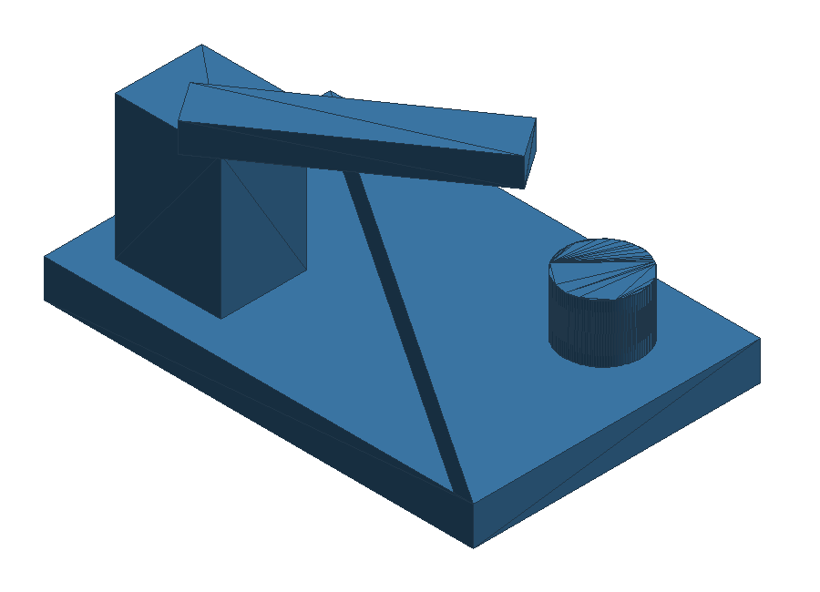
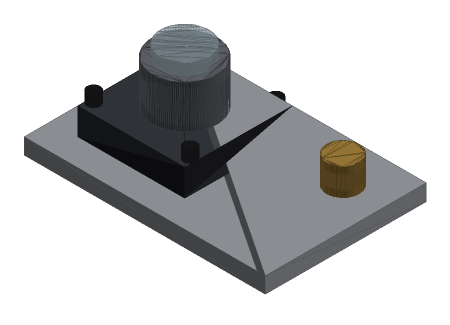

# CAD Agent Harness

`cadx` is a local CAD-as-code harness for coding agents. It lets an agent edit
ordinary `build123d` Python files, run them, collect CAD artifacts, inspect
spatial facts, render deterministic visual summaries, and evaluate requirement
checks with minimal human input.

The first implementation is intentionally CLI-first. MCP and richer browser
viewer integrations can wrap the same run artifacts once the local contract is
stable.





## Quick Start

```bash
python3 -m venv .venv
. .venv/bin/activate
pip install -e .[cad,render,test]
cadx init
cadx run design.py --params params.yaml
cadx inspect artifacts/runs/0001
cadx render artifacts/runs/0001
cadx shots artifacts/runs/0001 --views iso,side,top,front
cadx evaluate artifacts/runs/0001 --requirements requirements.yaml
cadx loop design.py --params params.yaml --requirements requirements.yaml --agent-command "<agent command>"
```

`cadx shots` renders shaded PNG screenshots of the run's primary STL (the
combined `assembly.stl` when a run has ≥2 parts, else the single part) from
several named cameras — `iso`, `top`, `side`, `front`, `rear` — writing
`shaded_<camera>.png` (default views `iso,side,top`; `--out DIR` to redirect).
It is the shared, on-demand version of a multi-angle screenshot script;
`render` still produces only the isometric shaded view in its contact sheet.

If `build123d` is not installed, `cadx run` still starts and reports a clear
dependency error when the design source imports `build123d`.

## Artifact Contract

Each successful run creates:

- `source_snapshot.py`
- `params.resolved.yaml`
- CAD exports when the runtime supports them
- `spatial.json`
- `diagnostics.json`
- `checks.json` after evaluation
- `report.md` after evaluation
- `views/contact.png` after rendering
- `views/shaded_iso.png` after rendering
- `artifacts/loop.json` after loop orchestration

The harness is designed so text-only agents can reason from JSON and
multimodal agents can inspect the rendered contact sheet and shaded CAD image.

## Requirement check types

`requirements.yaml` drives autonomous convergence. `cadx evaluate` supports these
check `type`s:

- `dimension` — a scalar bounding box / size / distance against `equals` or a
  `min`/`max` range with `tolerance`.
- `topology` — expected solids/faces/edges/vertices counts.
- `clearance` — minimum gap between two objects; AABB by default, exact BREP with
  `method: exact`.
- `feature_count` — number of features of a `kind` (e.g. `cylindrical_hole`).
- `feature_dimension` — a property across features selected by kind.
- `feature_alignment` — two features (holes) are coaxial and diameter-compatible.
- `interference` — no pair of solids overlaps (BREP intersection volume).
- `center_of_mass` — a part or assembly center of mass at a target point/region.
- `stability` — the projected center of mass lies inside a support polygon.
- `bend` — sheet-metal bend count/angle/radius/direction from `bends.json`.
- `manufacturability` — laser/sheet DFM rules (min hole diameter, slot width,
  web, hole-to-edge, bend radius, hole-to-bend) parameterized by thickness.
- `parametric` — re-run the design across multiple parameter sets and aggregate
  ordinary sub-checks (tolerance/stack-up studies); see `cadx sweep`.

`symmetry` and `visual` are listed in the specification but are **not yet
implemented**; a design that uses them will get a clear `ValueError`. Any other
unknown `type` likewise raises a `ValueError` naming the type rather than silently
passing.

A `parametric` example:

```yaml
checks:
  - id: width_stackup
    type: parametric
    params:
      - {width: 38}
      - {width: 42}
    checks:
      - id: width_in_range
        type: dimension
        target: obj.plate.bbox.size.x
        min: 36
        max: 44
```

## Manufacturing package

`publish_flat` / `publish_sheet_metal` emit SendCutSend-clean DXF flat patterns
(with bend lines on a `bend` layer and a `bends.json` table), `publish_part_meta`
plus `cadx bom <run_dir>` produce a deterministic `bom.csv`/`bom.json`, and every
export record carries explicit millimeter units.

## Assemblies

Position parts in a shared frame with `publish(label, obj,
placement=Location(...))`, or state the mating intent and let the harness
derive the transform:

```python
publish("base", base, role="final")
publish("tower", tower,
        mate=mate(to="base", anchor=Location((0, 0, -15)), target=Location((20, 5, 3))))
# or, with build123d RigidJoints defined on the shapes:
publish("tower", tower, mate=mate(to="base", joint="plug", target_joint="socket"))
```

Mates resolve to ordinary placements (chains allowed, any publish order), the
declared relationship is recorded on the spatial object, and cross-part checks
(`clearance`, `interference`, `feature_alignment`, `center_of_mass`,
`stability`) verify the assembled geometry. Multi-part runs additionally export
a combined `assembly.step`/`.stl`/`.glb` and render the whole assembly on the
contact sheet.

Kinematic kinds pose the mate about the target frame's local Z axis:
`kind="revolute"` (`angle` degrees), `kind="prismatic"` (`travel` mm), or
`kind="cylindrical"` (both), with optional `angle_range`/`travel_range` limits
that flag out-of-range poses. Feed the pose from `params` and sweep it with a
`parametric` check to verify the whole motion envelope:

```python
publish("lid", lid, mate=mate(to="box", kind="revolute",
        anchor=Location((0, -40, 0)), target=Location((0, 40, 20), (90, 0, 0)),
        angle=params.get("lid_angle", 0), angle_range=(0, 110)))
```

```yaml
- id: lid_swing_clear
  type: parametric
  params: [{lid_angle: 0}, {lid_angle: 55}, {lid_angle: 110}]
  checks:
    - id: no_collision
      type: interference
      tolerance: 0.001
```

## Materials (screenshot appearance)

Shaded renders (`cadx render`, `cadx shots`) color each part by its declared
appearance — looks only, no simulation. Declare it where the part is
published, or let BOM metadata imply it:

```python
publish("frame", frame, appearance="carbon_fiber")
publish("bolt", bolt, appearance="black_oxide")
publish("lens", lens, appearance="glass")          # translucent
publish("mount", mount, appearance="#ff8800")      # any hex color
publish_part_meta("plate", material="6061-T6 Aluminum")  # implies "aluminum"
```

Presets live in `cadx.materials.MATERIALS`: steel, stainless_steel, aluminum,
titanium, brass, copper, gold, zinc_plated, black_oxide,
anodized_black/red/blue, carbon_fiber (two-tone weave), glass (translucent),
rubber, and plastic_&lt;color&gt; variants. Undeclared parts cycle a distinct
default palette so bare assemblies still render with distinguishable parts;
unknown names fall back to the palette with an `appearance_unknown` warning in
the render manifest.

Screenshot lighting is steerable per `cadx shots` invocation:
`--light camera` front-lights each view with its own camera (the one-flag fix
for dark side/rear views), and `--light X,Y,Z` sets an explicit direction —
slightly off the camera axis (e.g. `0.3,1,0.5` for the side view) gives a
softer look than pure front light, which maximizes specular on camera-facing
faces. The resolved light vector is recorded on every shot for
reproducibility; `cadx render` keeps the fixed legacy light so diagnostic
contact sheets stay comparable across runs.
