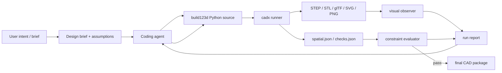

# Agentic CAD Harness for build123d

Date: 2026-06-09

Status: draft system specification

## Summary

This system is a local CAD-as-code harness for coding agents such as Codex. The agent writes or edits Python models that use `gumyr/build123d`, then the harness executes the model, exports precise and visual artifacts, computes structured spatial facts, evaluates requirement checks, and feeds those results back to the agent until the design passes.

The central design principle is: do not make the model depend only on a screenshot. Every run should produce both visual artifacts and machine-readable spatial observations. A multimodal agent can inspect rendered images. A text-only coding agent can still reason from dimensions, topology, named features, section measurements, validation failures, and diffs.

## Source Context

`build123d` is a Python parametric BREP CAD framework built on Open Cascade. It supports explicit 1D, 2D, and 3D geometry classes, builder and algebra modeling modes, selector APIs for topology exploration, and export formats including STEP, STL, glTF, SVG, DXF, BREP, and 3MF. The project recommends viewer integration, and the docs list `ocp-vscode` and Yet Another CAD Viewer among external viewers.

Relevant source links are listed at the end of this document.

## Goals

- Let an autonomous coding agent create, inspect, revise, and validate build123d CAD models with minimal human input.
- Give the agent visual and spatial feedback after every design iteration.
- Keep CAD source files normal Python so they can be edited by Codex or any similar coding agent.
- Preserve exact geometry artifacts for downstream CAD/CAM workflows.
- Provide deterministic evaluation gates so the agent can converge without repeatedly asking the user.
- Support both multimodal agents and text-only agents.

## Non-Goals

- Do not attempt to replace a professional CAD viewer.
- Do not require the user to hand-drive visual inspection.
- Do not make the agent infer all quality from raster screenshots.
- Do not depend on a proprietary CAD kernel beyond build123d's existing Open Cascade dependency.
- Do not put arbitrary natural-language design intent directly into manufacturing without explicit checks.

## High-Level Architecture



The harness should be implemented as:

- A Python package and CLI named `cadx`.
- An optional MCP server exposing the same operations as tools.
- A static browser viewer for interactive inspection.
- A deterministic artifact pipeline for images, JSON metrics, and CAD exports.

The CLI is the primary interface because Codex and similar agents can reliably run shell commands. The MCP server is useful when the host agent supports tool calls and image/file return values.

## Project Layout

```text
cad-project/
  design.py
  params.yaml
  requirements.yaml
  cadx.yaml
  tests/
    test_requirements.py
  artifacts/
    runs/
      0001/
        source_snapshot.py
        params.resolved.yaml
        result.step
        result.stl
        result.glb
        views/
          contact.png
          iso.png
          front.png
          right.png
          top.png
          section_xy.png
          projection_front.svg
        spatial.json
        checks.json
        diagnostics.json
        report.md
```

## Model Entry Contract

The agent should be able to write ordinary build123d code, but the harness needs a stable way to find the result. Support these conventions in order:

1. A callable `build(params: dict) -> Shape | Compound | Assembly`.
2. A module variable named `result`, `part`, `assembly`, or `model`.
3. Explicit publishing through `cadx.publish(name, shape, role=...)`.

Recommended pattern:

```python
from build123d import *
from cadx import publish


def build(params: dict):
    width = params.get("width_mm", 80)
    height = params.get("height_mm", 20)
    thickness = params.get("thickness_mm", 4)

    with BuildPart() as bracket:
        with BuildSketch():
            Rectangle(width, height)
            with GridLocations(width - 20, 0, 2, 1):
                Circle(3, mode=Mode.SUBTRACT)
        extrude(amount=thickness)
        fillet(edges().filter_by(Axis.Z), radius=1)

    publish("main_bracket", bracket.part, role="final")
    return bracket.part
```

The harness records source snapshots per run so the agent can compare the exact code that generated each artifact.

## Agent-Facing Commands

### `cadx init`

Creates `cadx.yaml`, `params.yaml`, and a starter `requirements.yaml`.

### `cadx run design.py --params params.yaml`

Executes the design in an isolated worker process and creates a numbered run directory.

Returns compact JSON:

```json
{
  "run_id": "0007",
  "status": "ok",
  "artifact_dir": "artifacts/runs/0007",
  "published": ["main_bracket"],
  "errors": []
}
```

### `cadx inspect artifacts/runs/0007`

Computes spatial facts, topology summaries, named feature data, and manufacturing heuristics.

### `cadx render artifacts/runs/0007 --canonical --sections --annotate`

Creates a contact sheet and per-view images. The canonical default should include:

- Isometric shaded view.
- Front, right, top orthographic views.
- Hidden-line SVG projections.
- Section cuts through principal planes.
- Bounding box and axis triad.
- Labels for published objects and detected features.
- Optional color-coded face, edge, and vertex IDs.

### `cadx evaluate artifacts/runs/0007 --requirements requirements.yaml`

Runs deterministic checks and writes `checks.json`.

### `cadx compare artifacts/runs/0006 artifacts/runs/0007`

Reports changes in dimensions, topology counts, mass properties, visual silhouettes, and failed/passed checks.

### `cadx loop --agent-command "<command>"`

Optional orchestration mode. Runs the coding agent, evaluates the result, and repeats until pass, max iterations, or a hard blocker.

## Optional MCP Tools

The MCP server should expose the same operations:

- `cad_run(source_path, params_path) -> RunSummary`
- `cad_inspect(run_id) -> SpatialSummary`
- `cad_render(run_id, options) -> ImageArtifacts`
- `cad_evaluate(run_id, requirements_path) -> CheckSummary`
- `cad_compare(left_run_id, right_run_id) -> DiffSummary`
- `cad_open_viewer(run_id) -> URL`

Each tool should return concise JSON plus file references. Image-returning tools should return the contact sheet first, then individual views only on request.

## Visual Feedback Design

The default visual artifact is a contact sheet named `views/contact.png`.

Required panels:

- `ISO SHADED`: three-quarter view with axes and object labels.
- `TOP`, `FRONT`, `RIGHT`: orthographic views with consistent scale.
- `SECTION XY`, `SECTION XZ`, `SECTION YZ`: cross sections through the bounding-box center.
- `PROJECTION`: hidden-line drawing generated from build123d projection when available.
- `CHECK OVERLAY`: red/yellow/green markers for failed, warning, and passed feature checks.

The contact sheet should include a compact data strip:

```text
units=mm | bbox=80.0 x 20.0 x 4.0 | volume=6075.3 | solids=1 | faces=18 | edges=42 | checks=12/13 pass
```

Guidelines:

- Keep camera positions deterministic.
- Use a neutral material and high contrast edge lines.
- Color published components consistently across runs.
- Render failed features with markers that match IDs in `checks.json`.
- Include visible axes and scale bars so a model can reason spatially from a screenshot.
- Avoid perspective distortion for dimension-sensitive panels.

## Spatial Feedback Design

The visual channel is not enough. Each run must also produce `spatial.json`:

```json
{
  "schema_version": "1.0",
  "units": "mm",
  "objects": [
    {
      "id": "obj.main_bracket",
      "label": "main_bracket",
      "role": "final",
      "bbox": {
        "min": [-40.0, -10.0, 0.0],
        "max": [40.0, 10.0, 4.0],
        "size": [80.0, 20.0, 4.0]
      },
      "mass_properties": {
        "volume": 6075.3,
        "center_of_mass": [0.0, 0.0, 2.0],
        "area": 3840.2
      },
      "topology": {
        "solids": 1,
        "shells": 1,
        "faces": 18,
        "wires": 24,
        "edges": 42,
        "vertices": 28
      }
    }
  ],
  "features": [
    {
      "id": "feat.mount_hole_left",
      "kind": "cylindrical_hole",
      "center": [-30.0, 0.0, 2.0],
      "axis": [0.0, 0.0, 1.0],
      "diameter": 6.0,
      "through": true
    }
  ]
}
```

The inspector should use build123d topology selectors and ShapeList operations where possible. It should also support explicit feature publishing from the model source because automatic feature detection will never be perfect.

Recommended explicit feature API:

```python
from cadx import publish_feature

publish_feature(
    "mount_hole_left",
    kind="hole",
    center=(-30, 0, 2),
    axis=(0, 0, 1),
    diameter=6,
    through=True,
)
```

## Requirement Schema

`requirements.yaml` should be the main source of truth for autonomous convergence.

Example:

```yaml
units: mm
intent: wall-mounted bracket for a 2020 aluminum extrusion
assumptions:
  - Use metric dimensions unless otherwise specified.
  - Prefer 3D-printable geometry with no unsupported thin walls.
checks:
  - id: bbox_width
    type: dimension
    target: obj.main_bracket.bbox.size.x
    equals: 80
    tolerance: 0.2
  - id: mount_hole_count
    type: feature_count
    kind: cylindrical_hole
    equals: 2
  - id: mount_hole_diameter
    type: feature_dimension
    selector:
      kind: cylindrical_hole
    property: diameter
    equals: 6
    tolerance: 0.1
  - id: min_wall
    type: manufacturability
    rule: min_wall_thickness
    min: 2.0
  - id: no_interference
    type: assembly_clearance
    min_clearance: 0.3
```

Requirement types:

- `dimension`: bounding boxes, distances, radii, hole diameters, angles.
- `topology`: expected solids, faces, edges, closed shells.
- `feature_count`: holes, slots, bosses, ribs, mounting points.
- `symmetry`: mirror or rotational symmetry around named planes or axes.
- `clearance`: distance between components, holes, imported references, or keep-out zones.
- `manufacturability`: minimum wall, minimum fillet, overhang, nonmanifold mesh, sharp internal corners.
- `visual`: silhouette similarity, projection overlap, or image diff against a reference.
- `parametric`: pass the same checks across multiple parameter sets.

## Evaluation Loop

Default loop:

1. Parse user intent into `requirements.yaml` and `params.yaml`.
2. Agent writes or edits `design.py`.
3. Harness runs the model.
4. If execution fails, return traceback plus the smallest relevant source excerpt.
5. If execution succeeds, export exact and visual artifacts.
6. Inspect spatial facts and detected features.
7. Evaluate requirements.
8. Return a report to the agent.
9. Agent patches source or requirements assumptions.
10. Stop when checks pass or the harness detects a hard ambiguity.

The report should be short enough for agent context:

```text
Run 0007: FAIL, 10/13 checks passed

Failed:
- mount_hole_diameter: expected 6.0 +/- 0.1 mm, observed [5.0, 5.0]
- bbox_width: expected 80.0 +/- 0.2 mm, observed 78.0
- min_wall: sampled minimum wall 1.3 mm below required 2.0 mm near marker wall_03

Artifacts:
- views/contact.png
- spatial.json
- checks.json
```

## Closing the Loop Beyond Vision

Visual inspection is necessary but insufficient. Add these additional feedback channels:

- Parametric sweeps: run the same design across edge-case parameter sets.
- Golden reference diffs: compare against an earlier accepted run or imported STEP/STL.
- Section analysis: inspect cross sections for hollow spaces, wall thickness, and hidden intersections.
- Assembly checks: use imported fixtures and keep-out volumes to test fit.
- Selector stability checks: warn when the model uses fragile positional selectors without labels.
- Manufacturing checks: estimate printability, minimum wall thickness, support risk, and mesh validity.
- Documentation checks: require published features and named dimensions for nontrivial models.
- Cost checks: approximate material volume, bounding box, and print time proxy.

For high-stakes physical parts, the harness should require explicit human review before manufacturing export, even if automated checks pass.

## Minimal Human Input Policy

The default interaction policy is "assume, document, test, iterate."

The agent should ask the human only when:

- A safety-critical or manufacturing-critical choice is underdetermined.
- Two plausible interpretations produce materially different geometry.
- A requested part depends on unknown mating geometry that cannot be inferred or imported.
- Automated checks pass but the visual output contradicts the user's stated intent.

All assumptions must be written to `requirements.yaml`. The agent can change assumptions while iterating, but the final report must list them.

## Rendering Pipeline

Recommended baseline:

1. Use build123d to generate exact shape objects.
2. Export STEP for exact CAD interchange.
3. Export STL or 3MF for manufacturing-oriented mesh checks.
4. Export glTF or GLB for browser rendering.
5. Use build123d projection APIs plus `ExportSVG` for deterministic hidden-line drawings.
6. Render glTF/GLB to PNG using a headless browser with a local Three.js viewer, or use a Python render backend if available.
7. Generate a contact sheet with Pillow.

The browser viewer should be static and local:

- Load `result.glb`.
- Show named components.
- Toggle wireframe, transparency, section planes, face IDs, and measurement mode.
- Support URL parameters for camera position and selected feature.
- Be usable by an in-app browser or Playwright for automated screenshots.

## Inspector Pipeline

The inspector should compute:

- Bounding boxes and principal dimensions.
- Volume, surface area, center of mass, and inertia if available.
- Topology counts.
- Shape validity and manifold/closed solid status.
- Component hierarchy and labels.
- Named feature registry.
- Detected cylindrical holes, slots, planar faces, axes, and symmetry planes.
- Cross-section summaries.
- Pairwise component collisions and clearances.

Automatic feature detection should be treated as advisory. Critical dimensions should be published explicitly by the model or checked through deterministic selectors.

## Coding Conventions for the Agent

The harness should bias the agent toward reliable build123d patterns:

- Start complex models in 2D, then extrude, revolve, sweep, or loft.
- Parameterize important dimensions.
- Delay 3D chamfers and fillets until late in the model.
- Name components, fixtures, and critical features.
- Prefer explicit published dimensions over brittle face/edge ordering.
- Keep assemblies decomposed into named parts.
- Export exact CAD artifacts even when visual artifacts pass.

## Safety and Isolation

CAD source is Python code and should be treated as executable workspace code.

Required controls:

- Run design code in a separate process.
- Enforce timeout and memory limits.
- Restrict output paths to the project artifact directory.
- Block network access by default.
- Capture stdout, stderr, tracebacks, and warnings.
- Snapshot source and resolved parameters for every run.
- Never delete prior run artifacts automatically.

## Implementation Plan

### Phase 1: MVP

- `cadx run`
- `cadx inspect`
- `cadx render`
- `cadx evaluate`
- STEP, STL, GLB, SVG, and PNG contact sheet outputs.
- Basic `requirements.yaml` checks for dimensions, topology, and named features.
- Compact report for agent consumption.

### Phase 2: Strong Agent Loop

- MCP server exposing the CLI operations.
- Visual diff and run-to-run compare.
- Section cuts and marker overlays.
- Automatic feature detection for holes, slots, cylinders, planar faces, and axes.
- Parametric sweep runner.
- Static browser viewer with measurement and feature selection.

### Phase 3: Advanced CAD Autonomy

- Assembly fixtures and keep-out volumes.
- Reference import and geometric comparison.
- Manufacturability heuristics for 3D printing, CNC, and laser cutting.
- Constraint extraction from natural language briefs.
- Agent loop orchestration with stopping criteria and question budget.

## Acceptance Criteria for the Harness

- A coding agent can create a simple bracket from a brief, run the harness, inspect failures, revise the source, and reach passing checks without human intervention.
- Every successful run produces at least one exact CAD file, one mesh/viewer file, one contact sheet, one spatial JSON file, and one checks JSON file.
- The contact sheet is understandable without opening an interactive viewer.
- Text-only agents can diagnose failed dimensions from `checks.json` and `spatial.json`.
- Multimodal agents can inspect `views/contact.png` and correlate visual markers to check IDs.
- Re-running the same source and parameters produces deterministic artifact names and comparable metrics.
- The harness never silently accepts a model with execution errors, invalid geometry, missing final object, or failed required checks.

## Open Design Questions

- Should the first implementation target a pure CLI, or include MCP from day one?
- Should rendering use a local Three.js viewer, YACV, Blender, or a Python-only renderer?
- Which manufacturing domain is primary: 3D printing, CNC, sheet metal, laser cutting, or general CAD?
- How much automatic natural-language requirement extraction should be trusted before a human confirms assumptions?
- Should the harness support remote agent execution, or remain local-only for source safety?

## Recommended Initial Choice

Build the MVP as a local Python CLI first, with artifacts optimized for Codex:

- `design.py`, `params.yaml`, `requirements.yaml`.
- `cadx run && cadx evaluate`.
- `views/contact.png` plus `spatial.json` and `checks.json`.
- Static web viewer only after the core artifact loop works.
- MCP wrapper after the CLI stabilizes.

This keeps the first version useful to any coding agent and avoids coupling the design to one agent host.

## Sources

- build123d GitHub repository: https://github.com/gumyr/build123d
- build123d documentation: https://build123d.readthedocs.io/en/latest/
- build123d import/export documentation: https://build123d.readthedocs.io/en/latest/import_export.html
- build123d topology selection documentation: https://build123d.readthedocs.io/en/latest/topology_selection.html
- build123d tips and FAQ: https://build123d.readthedocs.io/en/latest/tips.html
- build123d external tools and viewers: https://build123d.readthedocs.io/en/latest/external.html
